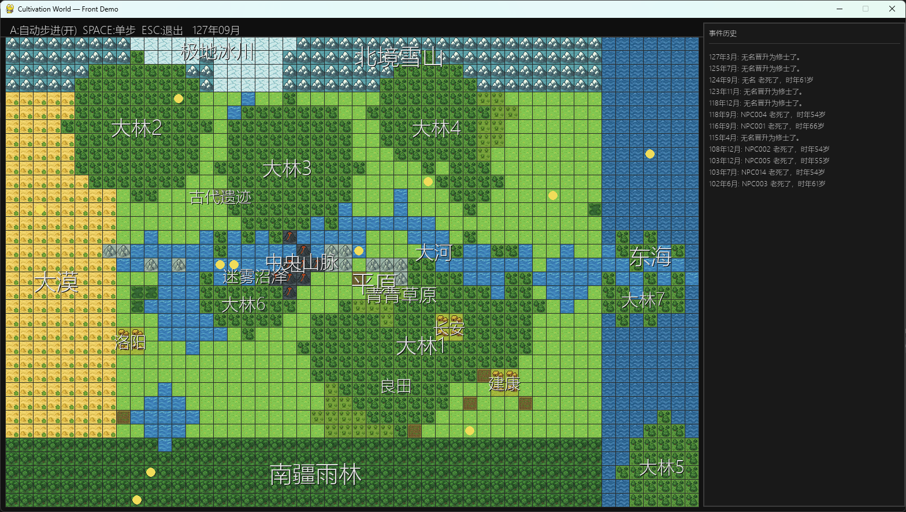

<!-- Language / 语言 -->
<p align="center">
  <a href="README.md">🇨🇳 中文</a> · <a href="EN_README.md">🇺🇸 English</a>
</p>
<p align="center">— ✦ —</p>

# Cultivation World Simulator

An AI-driven cultivation world simulator that aims to create a truly living, immersive xianxia world.

## Overview

Cultivation World Simulator combines traditional game-rule systems with large language models. By first establishing a complete ruleset for the cultivation world, it creates an autonomous, vibrant, immersive virtual world with emergent stories.

Core idea: **Build a credible rule-based world model first, then plug in AI to bring it to life.**

### Tech Stack

- **Frontend Rendering**: pygame (Web support in the future)
- **Simulation Engine**: custom event-driven simulator
- **World Model**: rule-based deterministic systems
- **AI Integration**: LLM-generated actions, decisions, micro-stories

## Background

I have been a long-time reader of xianxia novels, from classics to modern works. As a game AI practitioner, I believe today’s LLM capabilities are sufficient to support a xianxia-style world simulation.

However, LLM-only NPC decision/dialogue is not enough. A credible rule system must ground the world as the “world model”, and then AI makes it vivid.

I aim to create a pure, joyful, direct, living sense of immersion. Not a mere marketing demo, nor purely academic like “Stanford Town”, but a world that players can actually feel and inhabit.

If you like this project, consider starring it~ You can also watch intro videos for this project on my [Bilibili account](https://space.bilibili.com/527346837).



## Development Progress

### 🏗️ Foundation
- ✅ World map basics, time, event system
- ✅ Diverse terrain types (plain, mountain, forest, desert, water, etc.)
- ✅ Web-based frontend interface
- ✅ Simulation framework
- ✅ Configuration files
- ✅ Standalone release (packaged exe)
- ✅ Menu bar & Save & Load

### 🔭 Long-term Systems
- [ ] ECS parallel toolkit
- [ ] Novelization/imagery/video for history and events

### 🗺️ World System
- ✅ Basic tile mechanics
- ✅ Normal, cultivate, city, sect regions
- ✅ Same-tile NPC interactions
- ✅ Qi distribution and yields
- ✅ World event
- [ ] Dynamic worldview, map, history, sect, and notable figure generation

### 👤 Character System
- ✅ Core attributes
- ✅ Cultivation realms
- ✅ Spiritual roots
- ✅ Basic movement actions
- ✅ Trait & Personality
- ✅ Breakthrough system
- ✅ Relationships
- ✅ Interaction range
- ✅ Effect system: buffs/debuffs
- ✅ Techniques
- ✅ Combat equipment & auxiliary equipment
- ✅ Short/Long term memory
- ✅ Character's short and long term objectives, supporting player active setting
- [ ] Character compatibility
- [ ] Epithets/nicknames
- [ ] Skill learning system:
  - [ ] Learnable skills
  - [ ] Life professions (alchemy, formations, planting, forging, etc.)
- [ ] Mortals
- [ ] Prodigies (stronger abilities and AI)

### 🏛️ Organizations
- [ ] Sect system
  - ✅ Settings, techniques, healing, base, styles
  - ✅ Special sect actions: Hehuan Sect (dual cultivation), Hundred Beasts Sect (beast taming)
  - [ ] Sect will AI, sect tasks
  - ✅ Sect tiers
- [ ] Clans
- [ ] Court/Empire (TBD)
- [ ] Inter-organization relations

### ⚡ Action System
- ✅ Basic movement
- ✅ Action execution framework
- ✅ Defined actions (rule-complete)
- ✅ Long-duration actions and settlement
  - ✅ Multi-month actions (cultivate, breakthrough, play, etc.)
  - ✅ Auto-settlement upon completion
- ✅ Multiplayer actions: initiator + responder flow
- ✅ LLM actions that affect relationships
- ✅ Systematic action registration and runtime logic
- [ ] Richer actions

### 🎭 Event System
- [ ] World-scale events:
  - [ ] Auctions
  - [ ] Secret realm exploration
  - [ ] Martial tournaments
  - [ ] Heaven-earth Qi fluctuations
- [ ] Sudden events
  - [ ] Treasure/cave emergence
- [ ] Natural events:
  - [ ] Natural disasters
  - [ ] Beast tides

### ⚔️ Combat
- ✅ Advantages and counters
- ✅ Win-rate estimation system

### 🎒 Items
- ✅ Basic items and spirit stones
- [ ] Trading mechanics
- [ ] Economy system

### 🌿 Ecology
- ✅ Animals and plants
- ✅ Hunting, gathering, materials
- [ ] Beasts/monsters

### 🤖 AI Enhancements
- ✅ LLM interface integration
- ✅ Character AI (rules AI + LLM AI)
- ✅ Coroutine decision making, async, multithreaded speedups
- ✅ Long-term planning and goal-driven behavior
- ✅ Reactive responses to external stimuli
- ✅ LLM-driven NPC dialogue, thinking, interaction
- ✅ LLM-generated micro-stories
- ✅ Use different models (max/flash) per task needs
- ✅ Micro-theaters
  - ✅ Battle micro-theaters
  - ✅ Dialogue micro-theaters
  - ✅ Multiple writing styles
- [ ] NPC observation space design
- [ ] One-off choices (e.g., switch techniques or not)

### 🏛️ World Lore
- [ ] Lore framework
- [ ] Worldbuilding
- [ ] Ancient history generation

### Specials
- ✅ Fortuitous encounters
- ✅ Tribulations & Heart devils
- [ ] Paths/Daos
- [ ] Possession & Rebirth
- [ ] Formations
- [ ] Opportunities
- [ ] Flexible world rules
- [ ] Divination & Omens
- [ ] Male-female traits inversion

## Usage

### Run Steps
1. Clone the repo:
   ```bash
   git clone https://github.com/your-username/cultivation-world-simulator.git
   cd cultivation-world-simulator
   ```

2. Install dependencies:
   ```bash
   pip install -r requirements.txt
   ```

3. Configure LLM:
   Edit `static/config.yml`:
   ```yaml
    llm:
      model_name: "qwen-plus"  # or another model supported by LiteLLM
      key: "your-api-key-here"     # your API key
      base_url: "https://dashscope.aliyuncs.com/compatible-mode/v1"
   ```
   For supported models, refer to [litellm documentation](https://docs.litellm.ai/docs/providers)

4. Run:
   Need to start both backend and frontend.
   
   ```bash
   # In project root
   python src/server/main.py
   ```
   The browser will automatically open the web frontend.


## Contributors
- Aku, for world design & discussion

## License

This project is licensed as specified in the [LICENSE](LICENSE) file.

## Contact

If you have any questions or suggestions, feel free to open an Issue or Pull Request.
You're also welcome to leave a message on my [Bilibili account](https://space.bilibili.com/527346837)!

