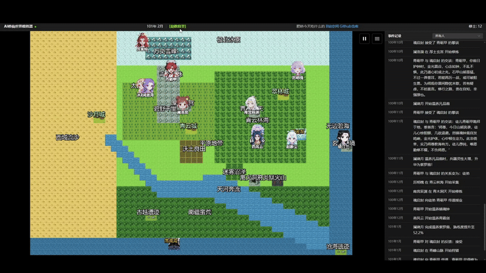
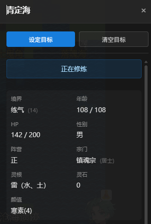
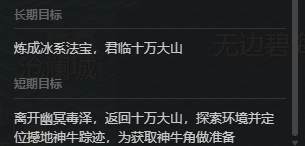

<!-- 语言 / Language -->
<h3 align="center">
  <a href="README.md">🇨🇳 中文</a> · <a href="EN_README.md">🇺🇸 English</a>
</h3>
<p align="center">— ✦ —</p>

# 修仙世界模拟器 (Cultivation World Simulator)


[](LICENSE)


<p align="center">
  
</p>

> **一个AI驱动的修仙世界模拟器，旨在创造一个真正活着的、有沉浸感的仙侠世界。**

## 📖 简介

这是一个 **AI 驱动的开放世界修仙模拟器**。

不同于传统的 RPG 扮演某个角色，在这里，**你将扮演“天道”（上帝）**。
你不需要亲自打怪升级，而是以上帝视角观察众生，在规则与 AI 共同编织的开放世界中，见证门派兴衰与天骄崛起。你可以静观沧海桑田，也可以降下天劫或魔改心灵，微妙地干预世界进程。

### ✨ 核心亮点

- 👁️ **扮演“天道” (上帝视角)**：你不是修士，而是掌控世界规则的**天道**。观察众生百态，体味苦辣酸甜。
- 🤖 **全员 AI 驱动**：每个 NPC 都独立基于LLM驱动，都有独立的性格、记忆、人际关系和行为逻辑。他们会根据即时局势做出决策，会有爱恨情仇，会结党营私，甚至会逆天改命。
- 🌏 **规则作为基石**：世界基于灵根、境界、功法、寿元等严谨的数值体系运行。AI 的想象力被限制在合理的修仙逻辑框架内，确保世界真实可信。
- 🦋 **涌现式剧情**：开发者也不知道下一秒会发生什么。没有预设剧本，只有无数因果交织出的世界演变。宗门大战、正魔之争、天骄陨落，皆由世界逻辑自主推演。

<table border="0">
  <tr>
    <td width="33%" valign="top">
      <h4 align="center">角色面板</h4>
      
      <br/><br/>
      <h4 align="center">性格特质</h4>
      
    </td>
    <td width="33%" valign="top">
      <h4 align="center">宗门体系</h4>
      
      <br/><br/>
      <h4 align="center">生平经历</h4>
      
    </td>
    <td width="33%" valign="top">
      <h4 align="center">自主思考</h4>
      
      <br/><br/>
      <h4 align="center">长短期目标</h4>
      
      <br/><br/>
      <h4 align="center">江湖绰号</h4>
      
    </td>
  </tr>
</table>

### 为什么要做这个？
修仙网文中的世界很精彩，但读者永远只能观察到一隅。

修仙品类游戏要么是完全的预设剧本，要么依靠人工设计的简单规则状态机，有许许多多牵强和降智的表现。

在大语言模型出现后，让“每一个角色都是鲜活的”的目标变得似乎可以触达了。

希望能够创造出纯粹的、快乐的、直接的、活着的修仙世界的沉浸感。不是像一些游戏公司的纯粹宣传工具，也不是像斯坦福小镇那样的纯粹研究，而是能给玩家提供真实代入感和沉浸感的实际世界。

## 联系方式
如果您对项目有任何问题或建议，欢迎提交 Issue 或 Pull Request。  
欢迎给我的[B站账号](https://space.bilibili.com/527346837)留言！  
也可以加入QQ群进行讨论：1071821688。进群需要输入我的B站昵称。  

## 功能开发进度

### 🏗️ 基础系统
- ✅ 基础世界地图、时间、事件系统
- ✅ 多样化地形类型（平原、山脉、森林、沙漠、水域等）
- ✅ 基于Web前端显示界面
- ✅ 基础模拟器框架
- ✅ 配置文件
- ✅ release 一键即玩的exe
- ✅ 菜单栏 & 存档 & 读档
- ✅ 灵活自定义LLM接口

### 🗺️ 世界系统
- ✅ 基础tile地块系统
- ✅ 基础区域、修行区域、城市区域、宗门区域
- ✅ 同地块NPC交互
- ✅ 灵气分布与产出设计
- ✅ 世界事件
- [ ] 动态世界观设定、地图、历史、宗门、名人生成

### 👤 角色系统
- ✅ 角色基础属性系统
- ✅ 修炼境界体系
- ✅ 灵根系统
- ✅ 基础移动动作
- ✅ 角色特质与性格
- ✅ 境界突破机制
- ✅ 角色间的相互关系
- ✅ 角色交互范围
- ✅ 角色Effects系统：增益/减益效果
- ✅ 角色功法
- ✅ 角色兵器 & 辅助装备
- ✅ 角色长短期记忆
- ✅ 角色的长短期目标，支持玩家主动设定
- ✅ 角色绰号
- [ ] 角色间相性
- [ ] 技能学习系统：
  - [ ] 可学习技能
  - [ ] 生活职业（丹药、阵法、种植、铸造etc）
- [ ] 凡人系统
- [ ] 天骄系统（更强能力，更强AI）

### 🏛️ 组织系统
- [ ] 宗门系统
  - ✅ 设定、功法、疗伤、驻地、行事风格
  - ✅ 宗门特殊动作：合欢宗（双修），百兽宗（御兽）
  - ✅ 宗门等阶
  - [ ] 宗门意志ai
  - [ ] 宗门任务
- [ ] 世家系统
- [ ] 朝廷系统（未定）
- [ ] 组织间关系网络

### ⚡ 动作系统
- ✅ 基础移动动作
- ✅ 动作执行框架
- ✅ 有明确规则的定义动作(Defined Action)
- ✅ 长动作执行和结算系统
  - ✅ 支持多月份持续的动作（如修炼、突破、游戏等）
  - ✅ 动作完成时的自动结算机制
- ✅ 多人动作：动作发起与动作响应
- ✅ 影响人际关系的LLM动作(LLM Action)
- ✅ 系统性的动作注册与运行逻辑

### 🎭 事件系统
- ✅ 天地灵气变动
- [ ] 世界范围大事件：
  - [ ] 拍卖会
  - [ ] 秘境探索
  - [ ] 比武大会
  - [ ] 宗门大比
- [ ] 突发事件
  - [ ] 宝物/洞府出世
- [ ] 自然事件：
  - [ ] 自然灾害
  - [ ] 兽潮

### ⚔️ 战斗系统
- ✅ 优劣互克关系
- ✅ 胜率计算系统

### 🎒 物品系统
- ✅ 基础物品、灵石框架
- ✅ 物品交易机制

### 🌿 生态系统
- ✅ 动植物
- ✅ 狩猎、采集、材料系统
- [ ] 魔兽

### 🤖 AI增强系统
- ✅ LLM接口集成
- ✅ 角色AI系统（规则AI + LLM AI）
- ✅ 协程化决策机制，异步运行，多线程加速ai决策
- ✅ 长期规划和目标导向行为
- ✅ 突发动作响应系统（对外界刺激的即时反应）
- ✅ LLM驱动的NPC对话、思考、互动
- ✅ LLM生成小片段剧情
- ✅ 根据任务需求分别接入max/flash模型
- ✅ 小剧场
  - ✅ 战斗小剧场
  - ✅ 对话小剧场
  - ✅ 小剧场不同文字风格
- ✅ 一次性选择（如是否要切换功法）

### 🏛️ 世界背景系统
- [ ] 背景故事框架
- [ ] 世界观生成
- [ ] 上古历史生成

### 特殊
- ✅ 奇遇
- ✅ 天劫 & 心魔
- [ ] 夺舍 & 重生
- [ ] 机缘 & 因果
- [ ] 占卜 & 谶纬
- [ ] 男生女相 & 女生男相
- [ ] 角色隐秘 & 双面人
- [ ] 飞升上界
- [ ] 阵法
- [ ] 道途
- [ ] 世界秘密 & 世界法则 （可灵活自定义） 
- [ ] 炼蛊
- [ ] 灭世危机
- [ ] 成为后世传奇

### 🔭 远期展望
- [ ] ECS并行
- [ ] 历史/事件的小说化&图片化&视频化
- [ ] MCP agent化，修士自行调用工具

## 使用方法

### 运行步骤
1. 克隆项目到本地：
   ```bash
   git clone https://github.com/your-username/cultivation-world-simulator.git
   cd cultivation-world-simulator
   ```

2. 安装依赖：
   ```bash
   # 后端依赖
   pip install -r requirements.txt
   
   # 前端依赖 (需Node.js环境)
   cd web && npm install
   ```

3. 配置LLM：
   在 `static/config.yml` 中配置LLM参数（OpenAI格式）：
   ```yaml
    llm:
      key: "your-api-key-here"        # 你的API密钥
      base_url: "https://api.xxx.com" # API地址
      model_name: "qwen-plus"         # 智能模型名称
      fast_model_name: "qwen-turbo"   # 快速模型名称
   ```

   也支持在前端直接配入LLM参数：
   
   

4. 运行：
   ```bash
   # 启动服务 (推荐开发模式，会自动启动前端)
   python src/server/main.py --dev
   ```
   浏览器会自动打开网页前端。


## 贡献者
- Aku, 世界观\玩法设计与讨论

## 致谢
- 参考了ai life engine部分ui

## 许可证

本项目采用 [LICENSE](LICENSE) 文件中指定的许可证。
