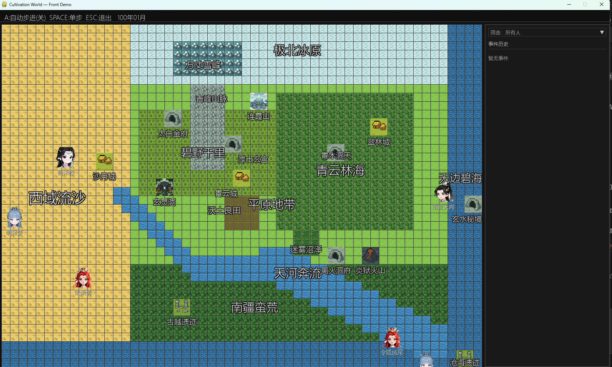

# 修仙世界模拟器 (Cultivation World Simulator)

一个基于规则和AI驱动的修仙世界模拟器，旨在创造一个真正活着的、有沉浸感的仙侠世界。

## 简介

修仙世界模拟器是一个结合传统游戏规则系统和现代AI技术的仿真项目。通过建立完整的修仙世界模型，包括地形、角色、修炼体系、人际关系等要素，创造一个可以自主运行、充满生机的虚拟修仙世界。

项目的核心理念是：**先建立可信的规则体系作为"世界模型"基础，再接入AI使世界生动起来**。

## 截图预览



## 功能开发进度

### 🏗️ 基础系统
- ✅ 基础世界地图系统
- ✅ 多样化地形类型（平原、山脉、森林、沙漠、水域等）
- ✅ 时间系统（年月时间戳）
- ✅ 前端显示界面（pygame）
- ✅ 基础模拟器框架
- ✅ 项目文档（README）
- ✅ 配置文件系统（config）
- [ ] Web前端支持（后期考虑）
- [ ] ECS并行工具（后期考虑）

### 🗺️ 地块系统
- ✅ 基础tile地块系统
- ✅ 基础区域、修行区域、城市区域
- ✅ 同地块NPC交互
- [ ] 灵气分布与产出设计
- [ ] 城市/宗派据点的机制

### 👤 角色系统
- ✅ 角色基础属性系统
- ✅ 修炼境界体系
- ✅ 灵根系统
- ✅ 基础移动动作
- ✅ 角色性格
- [ ] 角色突破机制：动态的突破成功概率、不同突破结果和效果
- ✅ 角色间的相互关系
- [ ] 角色特殊能力
- [ ] 角色绰号
- [ ] 角色Buffs系统：增益/减益效果、状态管理
- [ ] 战斗相关
  - [ ] 属性点分配
  - [ ] 技能系统（功法）
  - [ ] 装备系统
  - [ ] 法宝系统
- [ ] 技能学习系统：
  - [ ] 可学习技能
  - [ ] 个人技（灵活融入代码）
  - [ ] 生活职业（丹药、阵法、种植、铸造etc，配合特殊prompt和信息空间）
- [ ] 凡人角色支持
- [ ] 天骄系统（更强能力，更强AI）

### 🏛️ 组织系统
- [ ] 宗门系统
- [ ] 世家系统
- [ ] 朝廷系统（不确定）
- [ ] 组织间关系网络

### ⚡ 动作系统
- ✅ 基础移动动作
- ✅ 动作执行框架
- ✅ 有明确规则的定义动作(Defined Action)
- ✅ 长动作执行和结算系统
  - ✅ 支持多月份持续的动作（如修炼、突破、游戏等）
  - ✅ 动作完成时的自动结算机制
- ✅ 多人动作：动作发起与动作响应
- [ ] 影响人际关系的LLM动作(LLM Action)

### 🎭 事件系统
- [ ] 世界范围大事件：
  - [ ] 拍卖会
  - [ ] 秘境探索
  - [ ] 比武大会
- [ ] 突发事件
  - [ ] 规则发起事件
  - [ ] NPC发起事件
  - [ ] 宝物/洞府出世
  - [ ] 突发事件的小说化&CG化&影视化
- [ ] 自然事件：
  - [ ] 自然灾害
  - [ ] 兽潮

### ⚔️ 战斗系统
- [ ] 战斗方式设计（灵根影响技能与战斗风格）
- [ ] 优劣互克关系
- ✅ 胜率计算系统（简单）
- [ ] 战斗规则引擎

### 🎒 物品系统
- ✅ 基础物品、灵石框架
- [ ] 物品交易机制
- [ ] 经济系统

### 🌿 生态系统
- ✅ 动植物
- ✅ 狩猎、采集、材料系统
- [ ] 魔兽系统

### 🤖 AI增强系统
- ✅ LLM接口集成
- ✅ 角色AI系统（规则AI + LLM AI）
- ✅ 协程化决策机制，异步运行，多线程加速ai决策
- ✅ 长期规划和目标导向行为
- [ ] 突发动作响应系统（对外界刺激的即时反应）
- [ ] LLM驱动的NPC对话、思考、互动、事件总结
- [ ] 动态剧情生成
- [ ] NPC观测空间设计

### 🏛️ 世界背景系统
- [ ] 上古历史生成
- [ ] 世界观设定
- [ ] 背景故事框架

### 特殊
- [ ] 夺舍
- [ ] 重生
- [ ] 阵法
- [ ] 机缘
- [ ] 天劫 & 心魔
- [ ] 可灵活自定义的世界法则

## 使用方法

### 运行步骤
1. 克隆项目到本地：
   ```bash
   git clone https://github.com/your-username/cultivation-world-simulator.git
   cd cultivation-world-simulator
   ```

2. 安装依赖：
   ```bash
   pip install -r requirements.txt
   ```

3. 配置LLM：
   在 `static/config.yml` 中配置LLM参数：
   ```yaml
   llm:
     model_name: "gpt-3.5-turbo"  # 或其他litellm支持的模型名称
     key: "your-api-key-here"     # 你的API密钥
   ```
   具体支持的模型请参考 [litellm文档](https://docs.litellm.ai/docs/providers)

4. 运行模拟器：
   ```bash
   python -m src.run.run
   ```

### 基本操作
- 启动后会自动生成随机地图
- 可以观察角色在世界中的移动和行为
- 按ESC退出程序

## 项目背景

从小一直是修仙网文的读者，从最早的蜀山仙侠传，到比较新的赤心巡天，修仙网文陪伴了我非常多的时间。

作为游戏AI行业的从业者，对LLM这两年的进步感触很深。我认为，现在的LLM智能水平，已经足够支持起来一些仙侠风格的世界模拟了。

但是，纯粹只有LLM为NPC提供决策和对话能力是不够的。首先，要有可信的规则打底，作为修仙世界的"世界模型"。之后，才是接入LLM，使其生动起来。

我希望能够创造出纯粹的、快乐的、直接的、活着的修仙世界的沉浸感。不是像一些游戏公司的纯粹宣传工具，也不是像斯坦福小镇那样的纯粹研究，而是能给玩家提供真实代入感和沉浸感的实际世界。

## 技术架构

- **前端显示**: pygame (未来可能支持Web)
- **模拟引擎**: 自研事件驱动模拟器
- **世界模型**: 基于规则的确定性系统
- **AI集成**: 预留LLM接口，支持混合决策

## 贡献指南

欢迎对修仙世界模拟器项目的贡献！

## 许可证

本项目采用 [LICENSE](LICENSE) 文件中指定的许可证。

## 联系方式

如果您对项目有任何问题或建议，欢迎提交 Issue 或 Pull Request。
