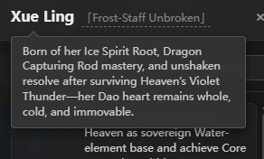

<!-- Language / Language -->
<h3 align="center">
  <a href="../../README.md">简体中文</a> · <a href="ZH-TW_README.md">繁體中文</a> · <a href="EN_README.md">English</a> · <a href="VI-VN_README.md">Tiếng Việt</a> · <a href="JA-JP_README.md">日本語</a>
</h3>
<p align="center">— ✦ —</p>

# Cultivation World Simulator


[](https://space.bilibili.com/527346837)

[](https://discord.gg/3Wnjvc7K)
[](../../LICENSE)


<p align="center">
  
</p>

> **Act as the "Heavenly Dao" and observe a cultivation world simulator driven by rule systems and AI as it evolves on its own.**
> **Fully LLM-driven, emergent ensemble storytelling, supports one-click Docker deployment, and is suitable for source code development and secondary creation.**

<p align="center">
  <a href="https://hellogithub.com/repository/4thfever/cultivation-world-simulator" target="_blank"></a>&nbsp;&nbsp;<a href="https://trendshift.io/repositories/20502" target="_blank"></a>
</p>

## 📖 Introduction

This is an **AI-driven cultivation world simulator**.
In the simulator, every cultivator is an independent Agent who can freely observe the environment and make decisions. At the same time, to avoid AI hallucinations and excessive divergence, a complex and flexible cultivation worldview and operating rules have been incorporated. In a world woven by rules and AI, cultivator Agents and sect wills compete and cooperate with each other, and new exciting plots constantly emerge. You can quietly observe the changes of the world, witness the rise and fall of sects and the rise of geniuses, or bring down heavenly tribulations or modify minds to subtly intervene in the world's progress.

### ✨ Core Highlights

- 👁️ **Play as "Heavenly Dao"**: You are not a cultivator, but the **Heavenly Dao** who controls the rules of the world. Observe all walks of life and experience their joys and sorrows.
- 🤖 **Fully AI-driven**: Every NPC is independently driven by LLM, with unique personality, memory, interpersonal relationships, and behavioral logic. They will make decisions based on the immediate situation, have love and hate, form cliques, and even change their fate against the heavens.
- 🌏 **Rules as the Foundation**: The world runs on a rigorous system composed of spiritual roots, realms, cultivation methods, personalities, sects, elixirs, weapons, martial arts tournaments, auctions, lifespans, and other elements. AI's imagination is limited within a reasonable and rich cultivation logic framework, ensuring the world is authentic and credible.
- 🦋 **Emergent Plot**: Even the developers don't know what will happen in the next second. There is no preset script, only world evolution woven by countless causes and effects. Sect wars, the struggle between righteous and demonic, and the fall of geniuses are all independently deduced by the world logic.

<table border="0">
  <tr>
    <td width="33%" valign="top">
      <h4 align="center">Sect System</h4>
      
      <br/><br/>
      <h4 align="center">City Region</h4>
      
      <br/><br/>
      <h4 align="center">Event History</h4>
      
    </td>
    <td width="33%" valign="top">
      <h4 align="center">Character Panel</h4>
      
      <br/><br/>
      <h4 align="center">Personality & Equipment</h4>
      
      <br/><br/>
      <h4 align="center">Independent Thinking</h4>
      
      <br/><br/>
      <h4 align="center">Nicknames</h4>
      
    </td>
    <td width="33%" valign="top">
      <h4 align="center">Dungeon Exploration</h4>
      
      <br/><br/>
      <h4 align="center">Character Info</h4>
      
      <br/><br/>
      <h4 align="center">Elixirs/Treasures/Weapons</h4>
      
      
      
    </td>
  </tr>
</table>

## 🚀 Quick Start

### Recommended Method

- **Want to modify code or debug**: Use source code deployment and prepare Python `3.10+`, Node.js `18+`, and available model services.
- **Want to experience directly**: Prioritize one-click Docker deployment.

### First Launch Instructions

- Whether using source code or Docker, after entering for the first time, you need to configure available model presets (such as DeepSeek / MiniMax / Ollama) on the settings page before starting a new game.
- In development mode, the frontend page usually opens automatically; if it doesn't, please visit the frontend address shown in the startup logs.

### Method 1: Source Code Deployment (Development Mode, Recommended)

Suitable for developers who need to modify code or debug.

1. **Install dependencies and start**
   ```bash
   # 1. Install backend dependencies
   pip install -r requirements.txt

   # 2. Install frontend dependencies (requires Node.js)
   cd web && npm install && cd ..

   # 3. Start service (automatically pulls up frontend and backend)
   python src/server/main.py --dev
   ```

2. **Configure Model**
   After selecting a model preset (such as DeepSeek / MiniMax / Ollama) on the frontend settings page, you can start a new game. The configuration will be automatically saved to the user data directory.

3. **Visit Frontend**
   Development mode will automatically pull up the frontend development server. Please visit the frontend address shown in the startup logs, usually `http://localhost:5173`.

### Method 2: Docker One-click Deployment (Untested)

No environment configuration required, just run directly:

```bash
git clone https://github.com/4thfever/cultivation-world-simulator.git
cd cultivation-world-simulator
docker-compose up -d --build
```

Visit frontend: `http://localhost:8123`

The backend container persists user data through `CWS_DATA_DIR=/data`, including settings, secrets, saves, and logs. It is mapped to the host's `./docker-data` by default, so this data will be retained even if `docker compose down` is executed and then `up` again.

<details>
<summary><b>LAN/Mobile Access Configuration (Click to expand)</b></summary>

> ⚠️ Mobile UI is not fully adapted yet, for early access only.

1. **Backend Configuration**: It is recommended to start the backend through environment variables, for example, execute `$env:SERVER_HOST='0.0.0.0'; python src/server/main.py --dev` in PowerShell. If you need to change the default value, you can edit the read-only configuration `system.host` in `static/config.yml`.
2. **Frontend Configuration**: Modify `web/vite.config.ts` and add `host: '0.0.0.0'` in the server block.
3. **Access Method**: Ensure the phone and computer are on the same WiFi, and visit `http://<Computer LAN IP>:5173`.

</details>

<details>
<summary><b>External API / Agent/Claw Access (Click to expand)</b></summary>

This part is suitable for external agent / Claw access, automation scripts, or achieving a closed-loop gameplay of "observation -> decision -> intervention -> re-observation".

It is recommended to develop directly around stable namespaces:

- Read-only Query: `/api/v1/query/*`
- Controlled Write: `/api/v1/command/*`

Common starting endpoints:

- `GET /api/v1/query/runtime/status`
- `GET /api/v1/query/world/state`
- `GET /api/v1/query/events`
- `GET /api/v1/query/detail?type=avatar|region|sect&id=<target_id>`
- `POST /api/v1/command/game/start`
- `POST /api/v1/command/avatar/*`
- `POST /api/v1/command/world/*`

The minimal access process is usually:

1. First call `GET /api/v1/query/runtime/status` to determine the current running state.
2. If the game has not started, call `POST /api/v1/command/game/start` to initialize.
3. Use `world/state`, `events`, and `detail` to pull world snapshots and target information.
4. Call a `command` to perform an intervention according to the strategy.
5. `query` again after intervention, do not rely on local cache to infer results.

When the interface is successful, it usually returns:

```json
{
  "ok": true,
  "data": {}
}
```

When it fails, it will return a structured error, and you can read `detail.code` and `detail.message` for program judgment.

Additional notes:

- Application settings are still managed through `/api/settings*` and `/api/settings/llm*`. They belong to the source of truth for settings and do not belong to the external control compatibility layer.
- For a more complete interface list, layered design, and extension conventions, please refer to `docs/specs/external-control-api.md`.

</details>

### 💭 Why make this?
The world in cultivation web novels is wonderful, but readers can only ever observe a corner of it.

Cultivation genre games are either completely preset scripts or rely on simple rule state machines designed by humans, with many far-fetched and unintelligent performances.

After the emergence of large language models, the goal of making "every character vivid" seems reachable.

I hope to create a pure, happy, direct, and living sense of immersion in the cultivation world. It's not like a pure publicity tool for some game companies, nor like a pure research like Stanford Town, but an actual world that can provide players with real sense of substitution and immersion.

## 📞 Contact
If you have any questions or suggestions for the project, welcome to submit an Issue.

- **Bilibili**: [Click to Follow](https://space.bilibili.com/527346837)
- **QQ Group**: `1071821688` (Answer to join: 肥桥今天吃什么)
- **Discord**: [Join Community](https://discord.gg/3Wnjvc7K)

---


## ⭐ Star History

If you find this project interesting, please give us a Star ⭐! This will motivate us to continuously improve and add new features.

<div align="center">
  <a href="https://star-history.com/#4thfever/cultivation-world-simulator&Date">
    
  </a>
</div>

# Plugins

Thanks to contributors for contributing plugins to this repo.

- [cultivation-world-simulator-api-skill](https://github.com/RealityError/cultivation-world-simulator-api-skill)
- [cultivation-world-simulator-android](https://github.com/RealityError/cultivation-world-simulator-android)

## 👥 Contributors

<a href="https://github.com/4thfever/cultivation-world-simulator/graphs/contributors">
  
</a>

For more contribution details, please check [CONTRIBUTORS.md](../../CONTRIBUTORS.md).

## 📋 Feature Development Progress

### 🏗️ Foundation System
- ✅ Basic world map, time, event system
- ✅ Diverse terrain types (plains, mountains, forests, deserts, waters, etc.)
- ✅ Web frontend-based display interface
- ✅ Basic simulator framework
- ✅ Configuration files
- ✅ release one-click playable exe
- ✅ Menu bar & Save & Load
- ✅ Flexible custom LLM interface
- ✅ Support Mac OS
- ✅ Multi-language localization
- ✅ Start game page
- ✅ BGM & Sound effects
- ✅ Player editable
- ✅ Roleplay mode

### 🗺️ World System
- ✅ Basic tile system
- ✅ Basic regions, cultivation regions, city regions, sect regions
- ✅ Same-tile NPC interaction
- ✅ Spiritual energy distribution and output design
- ✅ World events
- ✅ Heaven, Earth, and Mortal Rankings
- [ ] Larger and more beautiful maps & Random maps

### 👤 Character System
- ✅ Character basic attribute system
- ✅ Cultivation realm system
- ✅ Spiritual root system
- ✅ Basic movement actions
- ✅ Character traits and personality
- ✅ Realm breakthrough mechanism
- ✅ Interpersonal relationships between characters
- ✅ Character interaction range
- ✅ Character Effects system: buff/debuff effects
- ✅ Cultivation methods
- ✅ Weapons & Auxiliary equipment
- ✅ Cheat system
- ✅ Elixirs
- ✅ Character short and long-term memory
- ✅ Character's short and long-term goals, supporting player active setting
- ✅ Character nicknames
- ✅ Life skills
  - ✅ Gathering, Hunting, Mining, Planting
  - ✅ Casting
  - ✅ Alchemy
- ✅ Mortals
- [ ] Deity Transformation realm

### 🏛️ Organizations
- ✅ Sects
  - ✅ Settings, cultivation methods, healing, base, conduct style, tasks
  - ✅ Sect special actions: Hehuan Sect (dual cultivation), Baishou Sect (beast taming), etc.
  - ✅ Sect tiers
  - ✅ Orthodoxy
- [ ] Clans
- ✅ Imperial Court
- ✅ Organization Will AI
- ✅ Organization tasks, resources, functions
- ✅ Inter-organization relationship network

### ⚡ Action System
- ✅ Basic movement actions
- ✅ Action execution framework
- ✅ Defined actions with clear rules
- ✅ Long-term action execution and settlement system
  - ✅ Support multi-month continuous actions (such as cultivation, breakthrough, games, etc.)
  - ✅ Automatic settlement mechanism when the action is completed
- ✅ Multiplayer actions: action initiation and action response
- ✅ LLM actions affecting interpersonal relationships
- ✅ Systematic action registration and operation logic

### 🎭 Event System
- ✅ Heaven and earth spiritual energy changes
- ✅ Large multiplayer events:
  - ✅ Auction
  - ✅ Secret realm exploration
  - ✅ World Martial Arts Tournament
  - ✅ Sect preaching assembly
- [ ] Sudden events
  - [ ] Treasure/cave emergence
  - [ ] Natural disaster

### ⚔️ Combat System
- ✅ Advantage and counter relationship
- ✅ Win rate calculation system

### 🎒 Item System
- ✅ Basic items, spirit stone framework
- ✅ Item trading mechanism

### 🌿 Ecosystem
- ✅ Animals and plants
- ✅ Hunting, gathering, material system
- [ ] Demonic beasts

### 🤖 AI Enhancement System
- ✅ LLM interface integration
- ✅ Character AI system (Rule AI + LLM AI)
- ✅ Coroutine decision-making mechanism, asynchronous operation, multi-threaded acceleration of AI decision-making
- ✅ Long-term planning and goal-oriented behavior
- ✅ Sudden action response system (immediate response to external stimuli)
- ✅ LLM-driven NPC dialogue, thinking, interaction
- ✅ LLM generates small plot fragments
- ✅ Access max/flash models separately according to task requirements
- ✅ Micro-theaters
  - ✅ Combat micro-theaters
  - ✅ Dialogue micro-theaters
  - ✅ Different text styles for micro-theaters
- ✅ One-time choices (such as whether to switch cultivation methods)

### 🏛️ World Lore System
- ✅ Inject basic world knowledge
- ✅ Dynamic generation of cultivation methods, equipment, sects, and regional information based on user input history

### ✨ Special
- ✅ Fortuitous encounters
- ✅ Heavenly Tribulation & Heart Devil
- [ ] Opportunity & Karma
- [ ] Divination & Prophecy
- [ ] Character Secrets & Conspiracies
- [ ] Ascension to the upper realm
- [ ] Formations
- [ ] World secrets & World laws
- [ ] Gu
- [ ] World-ending crisis
- [ ] Found a sect / Establish a clan / Become emperor

###  telescope Long-term Prospects
- [ ] Novelization & Imaging & Video of history/events
- [ ] Skill agentification, cultivators independently plan, analyze, call tools, and make decisions
- [ ] Integrate your own Claw into the cultivation world
