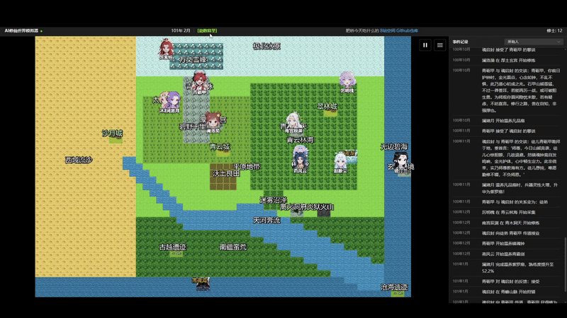
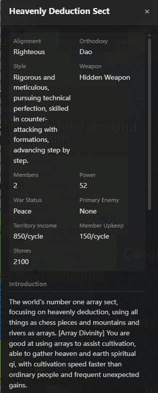
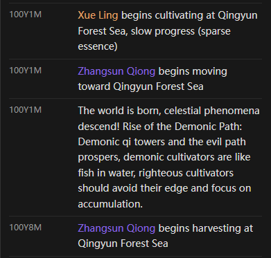
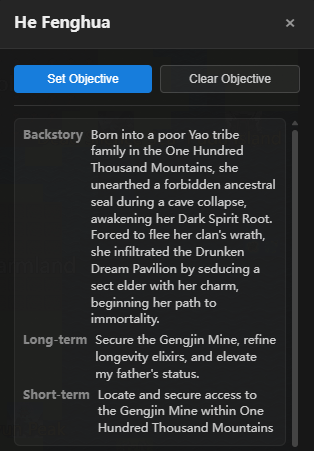
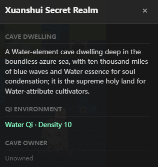
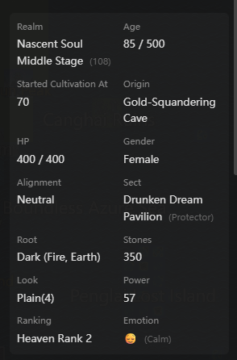

<!-- Language / 言語 -->
<h3 align="center">
  <a href="../../README.md">简体中文</a> · <a href="ZH-TW_README.md">繁體中文</a> · <a href="EN_README.md">English</a> · <a href="VI-VN_README.md">Tiếng Việt</a> · <a href="JA-JP_README.md">日本語</a>
</h3>
<p align="center">— ✦ —</p>

# 修仙世界シミュレーター (Cultivation World Simulator)


[](https://space.bilibili.com/527346837)

[](https://discord.gg/3Wnjvc7K)
[](../../LICENSE)


<p align="center">
  
</p>

> **あなたは「天道」として、ルール体系と AI によって駆動される修仙世界シミュレーターが自律的に進化していく様子を見守ります。**
> **全員が LLM 駆動、群像劇的な物語の創出、Docker によるワンクリックデプロイに対応し、ソースコード開発や二次創作にも適しています。**

<p align="center">
  <a href="https://hellogithub.com/repository/4thfever/cultivation-world-simulator" target="_blank"></a>&nbsp;&nbsp;<a href="https://trendshift.io/repositories/20502" target="_blank"></a>
</p>

## 📖 紹介

これは **AI 駆動の修仙世界シミュレーター** です。
シミュレーター内では、すべての修士が独立した Agent であり、自由に環境を観察し、意思決定を行うことができます。同時に、AI の幻覚や過度な発散を避けるため、複雑で柔軟な修仙世界観と運行ルールが組み込まれています。ルールと AI が共に織りなす世界の中で、修士 Agent たちと宗門の意志が互いに駆け引きし、協力し合い、新たな素晴らしいストーリーが絶えず生まれます。あなたは滄海変転を静観し、門派の興亡や天才の台頭を見守ることも、天劫を下したり心を書き換えたりして、世界の進展に微妙に干渉することもできます。

### ✨ コアハイライト

- 👁️ **「天道」を演じる**: あなたは修士ではなく、世界のルールを司る**天道**です。衆生のありさまを観察し、苦楽を味わってください。
- 🤖 **全員が AI 駆動**: 各 NPC は LLM に基づいて独立して駆動され、独立した性格、記憶、対人関係、行動ロジックを持っています。彼らは即時の状況に基づいて意思決定を行い、愛憎があり、派閥を作り、さらには天命に逆らって運命を変えることもあります。
- 🌏 **ルールを基石として**: 世界は、霊根、境界、功法、性格、宗門、丹薬、兵器、武道会、オークション、寿元などの要素で構成される厳格な体系に基づいて運行されています。AI の想像力は、合理的かつ十分に豊かな修仙ロジックの枠組み内に制限され、世界が真実で信頼できるものであることを保証します。
- 🦋 **創出されるストーリー**: 開発者も次の瞬間に何が起こるか分かりません。あらかじめ設定された脚本はなく、無数の因果が交錯して世界の進化が織りなされます。宗門大戦、正魔の争い、天才の没落などはすべて、世界のロジックによって自律的に推論されます。

<table border="0">
  <tr>
    <td width="33%" valign="top">
      <h4 align="center">宗門体系</h4>
      
      <br/><br/>
      <h4 align="center">都市区域</h4>
      
      <br/><br/>
      <h4 align="center">出来事履歴</h4>
      
    </td>
    <td width="33%" valign="top">
      <h4 align="center">キャラクターパネル</h4>
      
      <br/><br/>
      <h4 align="center">性格と装備</h4>
      
      <br/><br/>
      <h4 align="center">自律思考</h4>
      
      <br/><br/>
      <h4 align="center">江湖の二つ名</h4>
      
    </td>
    <td width="33%" valign="top">
      <h4 align="center">洞府探索</h4>
      
      <br/><br/>
      <h4 align="center">キャラクター情報</h4>
      
      <br/><br/>
      <h4 align="center">丹薬/法宝/武器</h4>
      
      
      
    </td>
  </tr>
</table>

## 🚀 クイックスタート

### 推奨方法

- **コードの変更やデバッグをしたい場合**: ソースコードデプロイを使用し、Python `3.10+`、Node.js `18+`、および利用可能なモデルサービスを用意してください。
- **直接体験したい場合**: Docker によるワンクリックデプロイを優先してください。

### 初回起動時の説明

- ソースコードでも Docker でも、初回起動後は設定ページで利用可能なモデルプリセット（DeepSeek / MiniMax / Ollama など）を設定してから、新しいゲームを開始する必要があります。
- 開発モードでは、通常フロントエンドページが自動的に開きます。自動的に開かない場合は、起動ログに表示されているフロントエンドのアドレスにアクセスしてください。

### 方法 1: ソースコードデプロイ（開発モード、推奨）

コードの変更やデバッグが必要な開発者に適しています。

1. **依存関係のインストールと起動**
   ```bash
   # 1. バックエンドの依存関係をインストール
   pip install -r requirements.txt

   # 2. フロントエンドの依存関係をインストール (Node.js が必要)
   cd web && npm install && cd ..

   # 3. サービスの起動 (フロントエンドとバックエンドを自動的に立ち上げます)
   python src/server/main.py --dev
   ```

2. **モデルの設定**
   フロントエンドの設定ページでモデルプリセット（DeepSeek / MiniMax / Ollama など）を選択すると、新しいゲームを開始できます。設定はユーザーデータディレクトリに自動的に保存されます。

3. **フロントエンドへのアクセス**
   開発モードではフロントエンド開発サーバーが自動的に立ち上がります。起動ログに表示されているフロントエンドのアドレス（通常は `http://localhost:5173`）にアクセスしてください。

### 方法 2: Docker ワンクリックデプロイ（未テスト）

環境設定は不要で、直接実行するだけです：

```bash
git clone https://github.com/4thfever/cultivation-world-simulator.git
cd cultivation-world-simulator
docker-compose up -d --build
```

フロントエンドへのアクセス：`http://localhost:8123`

バックエンドコンテナは `CWS_DATA_DIR=/data` を通じてユーザーデータを一元的に永続化します。これには設定、秘密鍵、アーカイブ、ログが含まれます。デフォルトでホストの `./docker-data` にマッピングされており、`docker compose down` を実行した後に再度 `up` しても、これらのデータは保持されます。

<details>
<summary><b>LAN/モバイルアクセス設定 (クリックで展開)</b></summary>

> ⚠️ モバイル UI はまだ完全に対応していません。お試し用としてご利用ください。

1. **バックエンド設定**: 環境変数を使用してバックエンドを起動することをお勧めします。例えば、PowerShell で `$env:SERVER_HOST='0.0.0.0'; python src/server/main.py --dev` を実行します。デフォルト値を変更する必要がある場合は、読み取り専用設定 `static/config.yml` の `system.host` を編集してください。
2. **フロントエンド設定**: `web/vite.config.ts` を変更し、server ブロックに `host: '0.0.0.0'` を追加します。
3. **アクセス方法**: スマホと PC が同じ WiFi 内にあることを確認し、`http://<PC の LAN IP>:5173` にアクセスします。

</details>

<details>
<summary><b>外部 API / Agent/Claw 連携 (クリックで展開)</b></summary>

この部分は、外部 agent / Claw の連携、自動化スクリプト、または「観察 -> 意思決定 -> 干渉 -> 再観察」のクローズドループプレイの実装に適しています。

安定した名前空間を中心に開発することをお勧めします：

- 読み取り専用クエリ：`/api/v1/query/*`
- 制御された書き込み：`/api/v1/command/*`

一般的な開始エンドポイント：

- `GET /api/v1/query/runtime/status`
- `GET /api/v1/query/world/state`
- `GET /api/v1/query/events`
- `GET /api/v1/query/detail?type=avatar|region|sect&id=<target_id>`
- `POST /api/v1/command/game/start`
- `POST /api/v1/command/avatar/*`
- `POST /api/v1/command/world/*`

最小限の連携フローは通常以下の通りです：

1. まず `GET /api/v1/query/runtime/status` を呼び出して、現在の実行状態を判断します。
2. まだ開始していない場合は、`POST /api/v1/command/game/start` を呼び出して初期化します。
3. `world/state`、`events`、`detail` を使用して、世界のスナップショットとターゲット情報を取得します。
4. 戦略に従って `command` を呼び出し、干渉を実行します。
5. 干渉後は再度 `query` を行い、ローカルキャッシュに依存して結果を推測しないでください。

インターフェースが成功すると、通常以下が返されます：

```json
{
  "ok": true,
  "data": {}
}
```

失敗した場合は構造化されたエラーが返されます。`detail.code` と `detail.message` を読み取ってプログラムで判断できます。

補足説明：

- アプリケーション設定は引き続き `/api/settings*` および `/api/settings/llm*` を通じて管理されます。これらは設定の真のソースであり、外部制御互換レイヤーには属しません。
- より完全なインターフェースリスト、階層設計、および拡張規約については、`docs/specs/external-control-api.md` を参照してください。

</details>

### 💭 なぜこれを作ったのか？
修仙ウェブ小説の世界は素晴らしいものですが、読者は常にその一端しか観察できません。

修仙ジャンルのゲームは、完全にプリセットされた脚本であるか、人間が設計した単純なルール状態マシンに依存しており、多くの不自然で知能の低い表現があります。

大規模言語モデルの登場後、「すべてのキャラクターを生き生きとさせる」という目標は、到達可能なものになったように思えます。

純粋で、楽しく、直接的で、生きている修仙世界の没入感を創り出したいと考えています。一部のゲーム会社のような純粋な宣伝ツールでも、スタンフォード・タウンのような純粋な研究でもなく、プレイヤーに真の代入感と没入感を提供できる実際の世界です。

## 📞 連絡先
プロジェクトに関する質問や提案があれば、Issue を提出してください。

- **Bilibili**: [フォローはこちら](https://space.bilibili.com/527346837)
- **QQ 群**: `1071821688` (入群の答え：肥桥今天吃什么)
- **Discord**: [コミュニティに参加](https://discord.gg/3Wnjvc7K)

---


## ⭐ Star History

このプロジェクトが面白いと思ったら、Star ⭐ をお願いします！継続的な改善と新機能の追加の励みになります。

<div align="center">
  <a href="https://star-history.com/#4thfever/cultivation-world-simulator&Date">
    
  </a>
</div>

# プラグイン

本リポジトリにプラグインを寄稿してくださったコントリビューターに感謝します。

- [cultivation-world-simulator-api-skill](https://github.com/RealityError/cultivation-world-simulator-api-skill)
- [cultivation-world-simulator-android](https://github.com/RealityError/cultivation-world-simulator-android)

## 👥 貢献者

<a href="https://github.com/4thfever/cultivation-world-simulator/graphs/contributors">
  
</a>

詳細な貢献については、[CONTRIBUTORS.md](../../CONTRIBUTORS.md) を確認してください。

## 📋 機能開発進捗

### 🏗️ 基礎システム
- ✅ 基礎世界マップ、時間、イベントシステム
- ✅ 多様な地形タイプ（平原、山脈、森林、砂漠、水域など）
- ✅ Web フロントエンド表示インターフェース
- ✅ 基礎シミュレーターフレームワーク
- ✅ 設定ファイル
- ✅ release ワンクリックで遊べる exe
- ✅ メニューバー & アーカイブ & ロード
- ✅ 柔軟なカスタム LLM インターフェース
- ✅ Mac OS 対応
- ✅ 多言語ローカライズ
- ✅ ゲーム開始ページ
- ✅ BGM & 効果音
- ✅ プレイヤー編集可能
- ✅ 扮演モード

### 🗺️ 世界システム
- ✅ 基礎 tile 地塊システム
- ✅ 基礎区域、修行区域、都市区域、宗門区域
- ✅ 同地塊 NPC インタラクション
- ✅ 霊気分布と産出設計
- ✅ 世界イベント
- ✅ 天地人榜
- [ ] より大きく美しいマップ & ランダムマップ

### 👤 キャラクターシステム
- ✅ キャラクター基礎属性システム
- ✅ 修行境界体系
- ✅ 霊根システム
- ✅ 基礎移動アクション
- ✅ キャラクターの特質と性格
- ✅ 境界突破メカニズム
- ✅ キャラクター間の相互関係
- ✅ キャラクターインタラクション範囲
- ✅ キャラクター Effects システム：バフ/デバフ効果
- ✅ 功法
- ✅ 兵器 & 補助装備
- ✅ チートシステム
- ✅ 丹薬
- ✅ キャラクターの短期・長期記憶
- ✅ キャラクターの短期・長期目標、プレイヤーによる能動的な設定をサポート
- ✅ キャラクターの二つ名
- ✅ 生活スキル
  - ✅ 採集、狩猟、採鉱、栽培
  - ✅ 鋳造
  - ✅ 炼丹
- ✅ 凡人
- [ ] 化神境界

### 🏛️ 組織
- ✅ 宗門
  - ✅ 設定、功法、療傷、駐地、行動スタイル、任務
  - ✅ 宗門特殊アクション：合歓宗（双修）、百獣宗（御獣）など
  - ✅ 宗門階級
  - ✅ 道統
- [ ] 世家
- ✅ 朝廷
- ✅ 組織意志 AI
- ✅ 組織任務、リソース、機能
- ✅ 組織間の関係ネットワーク

### ⚡ アクションシステム
- ✅ 基礎移動アクション
- ✅ アクション実行フレームワーク
- ✅ 明確なルールの定義アクション
- ✅ 長期アクションの実行と精算システム
  - ✅ 数ヶ月続くアクション（修行、突破、遊びなど）をサポート
  - ✅ アクション完了時の自動精算メカニズム
- ✅ 多人数アクション：アクションの開始と応答
- ✅ 対人関係に影響を与える LLM アクション
- ✅ 体系的なアクション登録と実行ロジック

### 🎭 イベントシステム
- ✅ 天地霊気の変動
- ✅ 多人数大イベント：
  - ✅ オークション
  - ✅ 秘境探索
  - ✅ 天下武道会
  - ✅ 宗門伝道大会
- [ ] 突発イベント
  - [ ] 宝物/洞府の出現
  - [ ] 天災

### ⚔️ 戦闘システム
- ✅ 優劣の相性関係
- ✅ 勝率計算システム

### 🎒 アイテムシステム
- ✅ 基礎アイテム、霊石フレームワーク
- ✅ アイテム取引メカニズム

### 🌿 生態システム
- ✅ 動植物
- ✅ 狩猟、採集、材料システム
- [ ] 魔獣

### 🤖 AI 強化システム
- ✅ LLM インターフェース統合
- ✅ キャラクター AI システム（ルール AI + LLM AI）
- ✅ コルーチン化された意思決定メカニズム、非同期実行、マルチスレッドによる AI 意思決定の加速
- ✅ 長期計画と目標指向の行動
- ✅ 突発アクション応答システム（外部刺激への即時反応）
- ✅ LLM 駆動の NPC 会話、思考、インタラクション
- ✅ LLM による短いストーリー断片の生成
- ✅ タスクの要求に応じて max/flash モデルを個別に接続
- ✅ 小劇場
  - ✅ 戦闘小劇場
  - ✅ 会話小劇場
  - ✅ 小劇場の異なるテキストスタイル
- ✅ 一回限りの選択（功法を切り替えるかどうかなど）

### 🏛️ 世界背景システム
- ✅ 基礎的な世界知識の注入
- ✅ ユーザー入力履歴に基づき、功法、装備、宗門、地域情報を動的に生成

### ✨ 特殊
- ✅ 奇遇
- ✅ 天劫 & 心魔
- [ ] 機縁 & 因果
- [ ] 占卜 & 讖緯
- [ ] キャラクターの秘密 & 陰謀
- [ ] 上界への飛昇
- [ ] 陣法
- [ ] 世界の秘密 & 世界の法則
- [ ] 蠱
- [ ] 滅世の危機
- [ ] 開宗立派/自立世家/皇帝になる

### 🔭 長期展望
- [ ] 歴史/イベントの小説化 & 画像化 & 動画化
- [ ] Skill の agent 化、修士が自ら計画、分析、ツールの呼び出し、意思決定を行う
- [ ] 自分の Claw を修仙世界に組み込む
